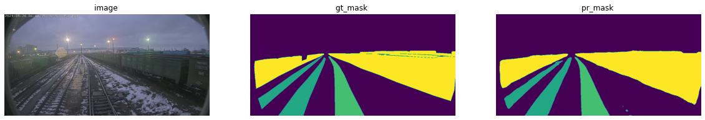

## Примеры обучения и инференса моделей для определения железнодорожной колеи и подвижного состава
Сайт соревнования: https://hacks-ai.ru  
  

 

  
### Обучение
В папке jupyters находятся ноутбуки для обучения моделей.  
Перед запуском обучения необходимо установить необходимые пакеты, находящиеся в файе requirements.txt (копия находится в первой ячейке ноутбуков, можно установить там).
Для запуска обучения необходимо установить путь до корневой папки, в которй находятся папка с картинками и масками.  
Обученные модели сохранятся в папке 'models'.  

### Предсказание
Для предиктов нужны модели их можно получить тремя способами:
  - просто запустить jupyter инференса и выполнить ячейку с загрузкой моделей. Они скачаются в папку models.
  - скачать <a href="https://drive.google.com/drive/folders/1nA6xeQDMK_Ari8koZ8gS33p3RWAYeGuw?usp=sharing"> тут </a> и положить в папку models.
  - обучить с помощью трейн jupyter.
  
Далее необходимо указать путь до папки с изображениями и запустить процесс предсказания.
  
После обучения изображения сохранятся в 'output/submission_images'.  

Обученные модели, а также ноутбуки обучения и инференса продублированы на гугл диске:  
<a href="https://drive.google.com/drive/folders/1nA6xeQDMK_Ari8koZ8gS33p3RWAYeGuw?usp=sharing"> Ссылка </a>
  
  
Обратная связь:  
  - Telegram: @denis_karachev
  - email: welcomedenk@gmail.com

